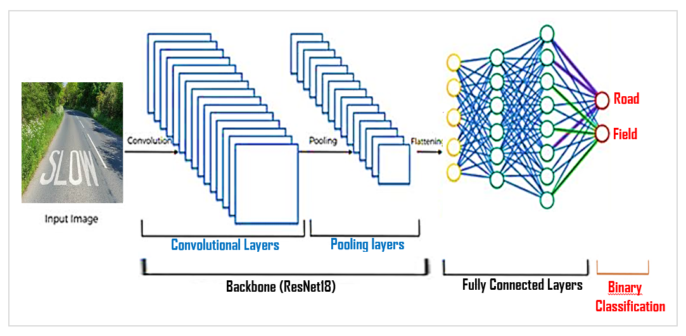

# **Algorithme d'Apprentissage Supervisé pour un Problème de Classification d'Images** :

## I. **Contexte et objectif de notre mini-projet :** 
### Nous allons former un modèle en PyTorch sur un datasat d'images pour classer les routes et les champs (classification binaire).
### Un des cas d'applications, une voiture autonome peut utiliser ce modèle pour distinguer les routes des champs et ainsi, éviter les champs et maintenir sa trajectoire  uniquement sur les routes.

__________________________________________________________________________________________________________________________
## II. **Dataset :**

#### **> Création** : Le dataset d'images a été crée par nous-meme, et ceci en collectant des images de routes et de champs depuis internet.
#### Deux dossiers ont été crées pour chaque classe d'images.
1.   dossier : data/roads pour les images de routes.
2.   dossier : data/fields pour les images de champs.

#### **> Taille** : Le dataset d'images contient 90 images et il est équilibré (45 images de routes / 45 images de champs).
 
#### **> Qualité** : Le dataset nous a été suffisant pour entraîner un modèle de classification efficace, car  c'est un dataset de qualité tels qu'on a bien sélectionné nos images (claires, variées, bonne taille) pour s'assurer que le modèle puisse généraliser ses performances sur de nouvelles images. 

#### **> Manipulation** : Les images sont renommées avec des nombres dans un ordre croissant (1, 2, ...) pour faciliter leur lecture.

__________________________________________________________________________________________________________________________

## III. **Modèle :** 
## 1. Type du modèle : Reseau de Neurones Convolutif (CNN)  
#### Les réseaux de neurones convolutionnels (CNN) sont un type de modèle d'apprentissage profond particulièrement adapté aux tâches de classification d'images et de reconnaissance d'objets.

                           -*-*-*-*-*-*-*-*-*-*-*-*-*-*-*-*-*-*-*-*-
## 2. Architecture du modèle : 
##### Pour résoudre cette tâche de traitement d'image, nous avons combiné un backbone avec des couches entièrement connectées (Fully connected)  

### 2.1 Backbone : ResNet18 
##### Le backbone est la structure de base d'un CNN qui a été pré-entraîné sur une grande base de données d'images et qui est utilisé comme modèle de référence pour extraire des caractéristiques / features de l'image (par exemple, contour, texture, couleur, etc), et qui est généralement composé de plusieurs couches de convolution et de pooling.
#### 2.1.1 Couches de convolutions 
##### Elles sont utilisées pour extraire des caractéristiques de l'image sous forme de filtres de convolution. Ces couches sont généralement suivies de couches de pooling.
#### 2.1.2 Couches de pooling
##### Elles sont utilisées pour réduire la dimensionnalité des caractéristiques extraites et aider à prévenir le surapprentissage.

### **Le backbone "ResNet18" est une architecture de CNN conçue pour les tâches de classification d'images. Il comprend 18 couches de neurones et a été entraîné sur l'ensemble de données ImageNet, qui comprend plus de 1,2 million d'images dans 1 000 classes différentes** .

### 2.2 Fully Connected
##### C'est un type de couche de réseau de neurones dans lequel tous les neurones de la couche précédente sont connectés à tous les neurones de la couche suivante. Les couches entièrement connectées sont utilisées dans les réseaux de neurones pour effectuer des opérations de classification (prédiction). Il recupère les features en entrée et retourne la classe de l'image en sortie.

                           -*-*-*-*-*-*-*-*-*-*-*-*-*-*-*-*-*-*-*-*-
## 3. Paramètres du modèle :

### 3.1 Fonction d'activation : ReLU (Unité Linéaire Rectifiée)
#### Une fonction d'activation est une fonction mathématique qui est appliquée à l'entrée d'un neurone dans un réseau de neurones afin de déterminer sa sortie. Elle joue un rôle important dans la capacité à apprendre et à effectuer des prédictions.
#### **La fonction d'activation "ReLU" est une fonction d'activation couramment utilisée dans les réseaux de neurones pour introduire une non-linéarité dans les modèles. Elle est définie par la formule suivante: f(x) = max(0, x) ce qui signifie que la sortie de la fonction ReLU pour un neurone est égale à la valeur de l'entrée si l'entrée est positive, et égale à 0 si l'entrée est négative**.

### 3.2 Optimiseur : SGD (Descente de Gradient Stochastique)
#### Un optimiseur est un algorithme utilisé pour pour ajuster les poids et les biais du modèle de manière à minimiser la fonction de coût / erreur sur l'ensemble d'entraînement.
#### **Descente de Gradient Stochastique "SGD" est un algorithme de descente de gradient qui utilise une petite portion des données d'entraînement (un échantillon) à chaque itération pour mettre à jour les poids et les biais du modèle**.

                           -*-*-*-*-*-*-*-*-*-*-*-*-*-*-*-*-*-*-*-*-
## 4. Métriques d'évaluation du modèle : 
#### Elles sont utilisées pour évaluer les performances du modèle

### 4.1 Fonction de coût / erreur : Entropie croisée ou fonction de coût logistique
#### Elle est utilisée comme fonction de coût non linéaire dans un modèle de réseau de neurones pour minimiser l'erreur du modèle. Elle est souvent utilisée avec la descente de gradient stochastique (SGD) pour ajuster les poids et les biais du modèle de manière à minimiser l'erreur sur l'ensemble d'entraînement. Elle est souvent utilisée dans les modèles de classification supervisée pour mesurer la performance du modèle. Elle est utilisée pour mesurer l'écart entre les prédictions du modèle et les valeurs cibles. Plus précisément, la fonction d'erreur entropie croisée est utilisée pour mesurer la "distance" entre la distribution de probabilité prédite par le modèle et la distribution de probabilité cible (réelle).
####  **Plus l'entropie croisée est basse, plus le modèle est performant**.

### 4.2 Précision (accuracy)
#### L'accuracy est une mesure de la performance d'un modèle de classification qui indique le pourcentage de prédictions correctes effectuées par le modèle. C'est une mesure de la qualité des prédictions du modèle et est utilisée pour évaluer la performance du modèle sur un ensemble de données de test.
####  **Plus l'accuracy est élévée, plus le modèle est performant**.
                           -*-*-*-*-*-*-*-*-*-*-*-*-*-*-*-*-*-*-*-*-

# **Bibliographie** :
### https://pytorch.org/
### https://pytorch.org/vision/main/models/generated/torchvision.models.resnet18.html
### https://www.kaggle.com/
### https://www.youtube.com/watch?v=K0lWSB2QoIQ&ab_channel=PatrickLoeber
